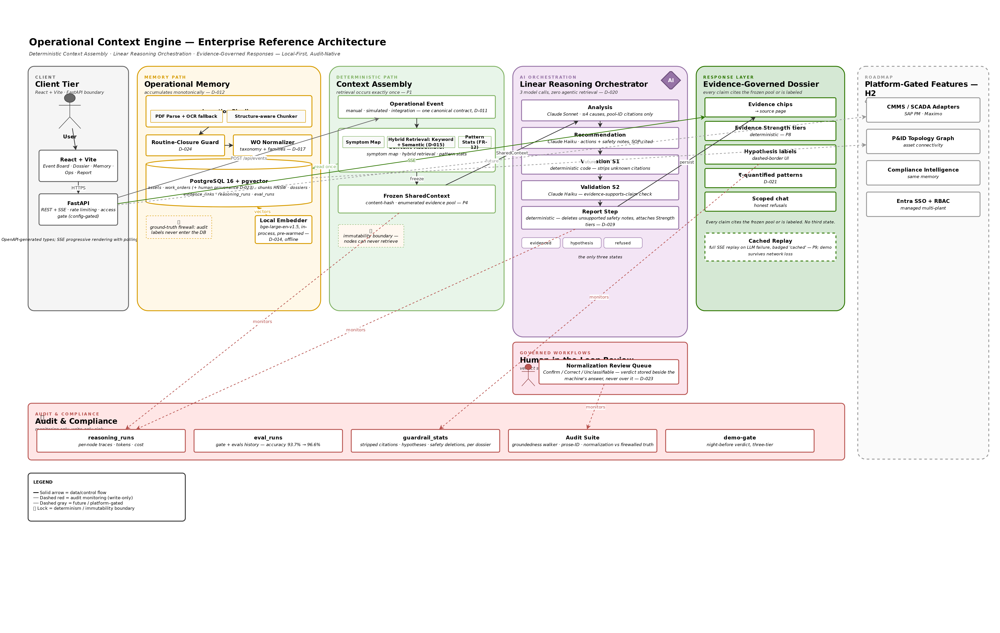

# Operational Context Engine (OCE)

**Operational decision intelligence for industrial reliability events.**

When critical equipment fails at 3am, the answer already exists - scattered across CMMS records, OEM manuals, SOPs, and retiring engineers' memory. OCE assembles the complete, evidence-backed **Context Dossier** around an asset in under 90 seconds. No search box required.

Built for the [ET AI Hackathon 2.0](https://github.com/DKDVE/et-hackathon) - *AI for Industrial Knowledge Intelligence: Unified Asset & Operations Brain*.

---

## Overview

OCE inverts the document-AI interaction model. Every workflow begins with a canonical **Operational Event** (seal leak, vibration alarm, operator log). The system reconstructs operational context around that asset - history, sister-asset incidents, manual excerpts, SOPs, probable causes, and recommended actions - with every claim traceable to source evidence or explicitly labeled as a hypothesis.

| Layer | Role |
|-------|------|
| **Operational Memory** | Ingests and accumulates plant knowledge (PDFs, work orders, SOPs) into PostgreSQL + pgvector |
| **Operational Context Engine** | Deterministically assembles shared context, then streams AI reasoning via LangGraph |

The entire stack runs locally with one command: Postgres, FastAPI backend, and Vite/React frontend via Docker Compose.



---

## Features

- **Event-driven dossiers** - Context assembles automatically from an operational event, not from a user query
- **Deterministic skeleton, streamed reasoning** - Factual sections render instantly; AI analysis streams in via SSE
- **Evidence-backed claims** - Every statement links to a work order, document page, or carries an explicit *Hypothesis* label
- **Evidence Strength tiers** - Strong / Moderate / Weak computed deterministically (never model-emitted confidence)
- **Honest refusals** - The system admits what it does not know rather than hallucinating
- **Synthetic Meridian plant dataset** - Fully reproducible demo data with ground-truth benchmarks

---

## Quick Start

### Prerequisites

| Requirement | Notes |
|-------------|-------|
| Docker + Docker Compose v2 | Runtime for the full stack |
| Git | Clone and version tracking |
| [uv](https://docs.astral.sh/uv/) (Python 3.12+) | Host-only, for `make dataset` |
| OpenRouter API key | Required when `REASONING_ENABLED=true` |

### 1. Clone and configure

```bash
git clone https://github.com/DKDVE/et-hackathon.git && cd et-hackathon
cp .env.example .env
# Edit .env: set OPENROUTER_API_KEY=sk-or-...
```

### 2. Build dataset and start the stack

```bash
make dataset    # Render PDFs/CSVs from dataset/design/meridian.yaml (~1 min)
make up         # db + backend + frontend - first build ~3 GB; allow 15–25 min
make seed       # Structure phase: wipe → load → verify
make ingest     # Chunk, embed, normalize (~3–5 min)
```

Wait for the backend log line **`Embedding model … ready`** before firing events (cold embedder load: 1–2 min).

### 3. Verify health

```bash
curl http://localhost:8000/health
# → {"status":"ok","db":"ok"}
```

### 4. Run the demo event

```bash
# Optional: dress the event board with 3 historical events
python3 scripts/simulate_event.py --background

# Hero event - P-3401 seal leak, criticality A
python3 scripts/simulate_event.py
```

The simulator prints the event ID and dossier URL. Open the dossier to watch deterministic sections render instantly, then AI reasoning stream in (~30–60s on a warm stack).

### Service URLs

| Service | URL |
|---------|-----|
| Event board | http://localhost:5173/events |
| API docs | http://localhost:8000/docs |
| Health | http://localhost:8000/health |

### Environment variables

| Variable | Default | Purpose |
|----------|---------|---------|
| `OPENROUTER_API_KEY` | *(empty)* | LLM access via OpenRouter |
| `REASONING_ENABLED` | `false` | Gate the reasoning layer |
| `DEMO_FALLBACK` | `0` | Replay cached SSE on LLM failure |
| `VITE_API_URL` | `http://localhost:8000` | Frontend → backend |
| `ACCESS_PASSWORD` | *(unset)* | HTTP Basic gate for hosted deploys; inert when empty |

---

## For Reviewers

A curated path through the project (~5 minutes):

| # | Resource | Description |
|---|----------|-------------|
| 1 | [`docs/MVP-STORYLINE.md`](docs/MVP-STORYLINE.md) | Full narrative arc and demo story |
| 2 | [`docs/OCE-pitch-deck.pptx`](docs/OCE-pitch-deck.pptx) | Pitch deck |
| 3 | [`docs/architecture/`](docs/architecture/) | Reference poster + C4 draw.io set |
| 4 | [`DECISIONS.md`](DECISIONS.md) | 27 logged architecture decisions |
| 5 | [`docs/ET-COMPLIANCE-REPORT.md`](docs/ET-COMPLIANCE-REPORT.md) | Hackathon compliance report |
| 6 | [`docs/FIGURES-CARD.md`](docs/FIGURES-CARD.md) | Sourced metrics for every claim |
| 7 | [`docs/demo-checklist.md`](docs/demo-checklist.md) | Rehearsal script |
| 8 | [`docs/DEMO-SCRIPT.md`](docs/DEMO-SCRIPT.md) | Live demo script |
| 9 | [`docs/expert-benchmark.md`](docs/expert-benchmark.md) | Expert evaluation benchmark |

**Night-before gate:** `make demo-gate` runs tests, audits, and a timed demo run.

---

## Verification

```bash
make test           # Default unit suite
make golden         # Golden fixtures + assembler (needs seed + ingest)
make verify-seed    # Destructive DB check (run in isolation)
make demo-gate      # Night-before gate: tests + audits + timed demo
make images-save    # Tarball images for USB-stick cold start
make images-load    # Load tarball on cold machine
```

### Cold-start timing (USB path)

| Step | Time |
|------|------|
| `make images-load` | ~2 min |
| `make dataset` | ~1 min |
| `make up` (images cached) | ~2 min + 1–2 min embedder |
| `make seed` | ~4 min |
| `make ingest` | ~4 min |
| **Total** | **~12–15 min** |

First build without USB: allow **15–25 min** for `make up` alone.

---

## Tech Stack

| Component | Technology |
|-----------|------------|
| Backend | FastAPI, SQLAlchemy 2.0, Alembic |
| Reasoning | LangGraph, OpenRouter (configurable per node) |
| Database | PostgreSQL 16 + pgvector |
| Embeddings | BGE (local, containerized) |
| Frontend | Vite, React, TypeScript, Tailwind, shadcn/ui |
| Runtime | Docker Compose |
| CI/CD | GitHub Actions |

---

## Project Structure

```
backend/       FastAPI + LangGraph reasoning + ingestion pipeline
frontend/      Vite/React dossier UI
dataset/       Meridian plant design (YAML) + rendered artifacts
scripts/       seed.py, simulate_event.py, demo_gate.sh
infra/azure/   Optional Azure deployment (ACA + PostgreSQL + SWA)
docs/          Storyline, architecture, compliance, benchmarks
```

**Design documents:** [`PRD.md`](PRD.md) · [`TDD.md`](TDD.md) · [`ArchitecturePrinciples.md`](ArchitecturePrinciples.md) · [`DECISIONS.md`](DECISIONS.md)

---

## Deployment (optional)

### Azure (recommended)

| Layer | Resource |
|-------|----------|
| API | Azure Container App `oce-backend` (2 vCPU / 4 GiB) |
| Database | Azure Database for PostgreSQL Flexible + pgvector |
| Frontend | Azure Static Web App (Free) |
| CD | GitHub Actions → ACR → ACA (OIDC, no client secrets) |

Full bootstrap, OIDC setup, seed procedure, and cost table: [`infra/azure/README.md`](infra/azure/README.md).

### Render (legacy)

Superseded by Azure. Preserved for reference: [`docs/deploy-alternatives/render/`](docs/deploy-alternatives/render/).


